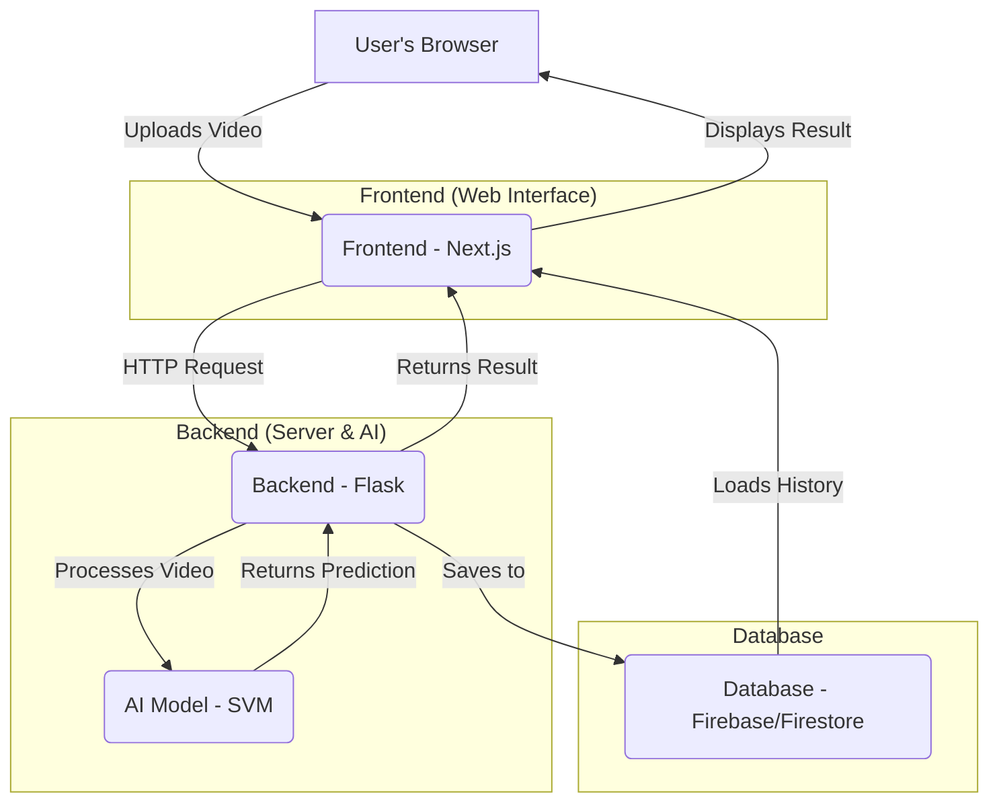

# Deepfake Detection System: Project Documentation

## 1. Project Overview

This project is a full-stack web application designed to detect deepfakes in video files. Users can upload a video through a modern web interface, and the system will analyze it using a machine learning model to determine if it is real or a deepfake.

The analysis results, including a prediction (Real/Fake), a confidence score, and a frame-by-frame breakdown, are then displayed to the user. The system also supports user accounts (via Firebase) to track and manage analysis history.

## 2. System Architecture

The application is composed of three main parts: a frontend, a backend, and a cloud-based database.



-   **Frontend:** A responsive web application built with **Next.js** and **React**, providing the user interface.
-   **Backend:** A **Python Flask** server that exposes a REST API to handle video processing, run the AI model for prediction, and communicate with the database.
-   **AI Model:** A **Support Vector Machine (SVM)** classifier trained to analyze facial landmark features extracted from video frames. This allows it to detect inconsistencies typical of deepfakes.
-   **Database:** **Firebase Firestore** is used for user authentication and for storing user-specific analysis history.

## 3. Tech Stack

| Component     | Technology         | Purpose                                                      |
| :------------ | :----------------- | :----------------------------------------------------------- |
| **Frontend**  | **Next.js / React**| Building the user interface.                                 |
|               | **TypeScript**     | For type-safe JavaScript code.                               |
|               | **Tailwind CSS**   | For styling the UI with a utility-first approach.            |
|               | **Framer Motion**  | For creating fluid animations and transitions.               |
| **Backend**   | **Python**         | The primary language for the server and AI model.            |
|               | **Flask**          | A lightweight web framework for the backend API.             |
|               | **scikit-learn**   | For building and running the SVM machine learning model.     |
|               | **OpenCV & Dlib**  | For video processing, face detection, and facial landmark extraction. |
| **Database**  | **Firebase/Firestore**| For user authentication and storing analysis results.        |
| **Deployment**| **Gunicorn**       | A WSGI server to run the Flask app in production.            |
|               | **Docker**         | A `Dockerfile` is included for containerizing the application for consistent deployment. |

## 4. How the AI Model Works

The core of the detection process is an analysis of facial landmark features.

1.  **Video Input:** The user uploads a video file via the web interface.
2.  **Frame Extraction:** The Flask backend uses **OpenCV** to decode the video and extract it into a series of individual frames (images).
3.  **Face Detection:** For each frame, the system attempts to detect human faces.
4.  **Facial Landmark Extraction:** If a face is found, it uses the **Dlib** library and the pre-trained `shape_predictor_68_face_landmarks.dat` model to identify 68 key points (landmarks) on the face, such as the corners of the eyes, the tip of the nose, and the jawline.
5.  **Feature Creation:** The coordinates of these 68 landmarks across all frames are collected and aggregated into feature vectors. These features represent the fine-grained structure and movement of the face throughout the video.
6.  **SVM Model Prediction:** These feature vectors are fed into the pre-trained **SVM model** (trained and saved as `svm_face_classifier.pkl`). The SVM is designed to classify the video as real or fake based on the extracted facial landmark features.
7.  **Output Generation:** The model outputs a final prediction ("Real" or "Fake") and a confidence score, which represents the model's certainty in its assessment. This result is sent back to the frontend.

## 5. Codebase Structure

A brief overview of the key files and directories in the project.

| File / Directory                                        | Purpose                                                                                             |
| :------------------------------------------------------ | :-------------------------------------------------------------------------------------------------- |
| `app.py`                                                | The main Flask backend server. It defines API endpoints like `/upload` for handling video analysis.   |
| `bckup/model_training.py`                               | Contains the code for training the SVM model and saving it.                                         |
| `requirements.txt`                                      | Lists all the Python dependencies required to run the backend and the AI model.                     |
| `frontend/`                                             | The root directory for the Next.js frontend application.                                            |
| `frontend/src/app/page.tsx`                             | The main page of the application, containing the UI for video upload and result display.            |
| `frontend/src/components/`                              | Contains reusable React components, such as `AnalysisHistory.tsx` and `UserProfile.tsx`.            |
| `frontend/src/services/analysisService.ts`              | Contains functions for communicating with the backend API and Firebase services.                    |
| `frontend/package.json`                                 | Lists all the Node.js dependencies required for the frontend.                                       |
| `deepfake_detection/shape_predictor_68_face_landmarks.dat`| The pre-trained model file from Dlib used for the critical step of facial landmark detection.       |
| `Dockerfile`                                            | Instructions for building a Docker image of the application.                                        |
| `gunicorn_config.py`                                    | Configuration for the Gunicorn WSGI server.                                                         |

## 6. Project Setup and Installation

Follow these steps to get the project running on your local machine.

### Prerequisites
- Python 3.8+
- Node.js and npm

### Backend Setup

1.  **Navigate to the project root** in your terminal.
2.  **Create and activate a Python virtual environment:**
    ```bash
    # Create the virtual environment
    python3 -m venv venv

    # Activate it (on macOS/Linux)
    source venv/bin/activate

    # Or activate it (on Windows)
    # venv\Scripts\activate
    ```
3.  **Install Python dependencies:**
    ```bash
    pip install -r requirements.txt
    ```

### Frontend Setup

1.  **Open a new terminal window** and navigate to the `frontend` directory:
    ```bash
    cd frontend
    ```
2.  **Install Node.js dependencies:**
    ```bash
    npm install
    ```
3.  **(Optional but Recommended) Create a local environment file:**
    -   In the `frontend/` directory, create a new file named `.env.local`.
    -   Add the following line to it. This tells your frontend the address of your local backend server.
        ```
        NEXT_PUBLIC_API_URL=http://127.0.0.1:5001
        ```

## 7. How to Run the Application

To use the application, you must have both the backend and frontend servers running at the same time.

### Step 1: Run the Backend Server

-   In your first terminal (with the Python virtual environment activated and in the project root), run the Flask application:
    ```bash
    python app.py
    ```
-   The backend API will start, typically on `http://127.0.0.1:5001`.

### Step 2: Run the Frontend Server

-   In your second terminal (in the `frontend/` directory), run the Next.js development server:
    ```bash
    npm run dev
    ```
-   The frontend application will start, typically on `http://localhost:3000`.

### Step 3: Access the Application

-   Open your web browser and navigate to **`http://localhost:3000`**.
-   You can now use the application to upload videos for analysis. 